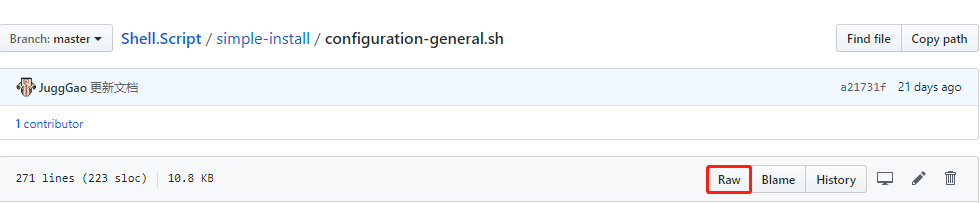

# Shell.Script

工作之中使用的简单 Shell 脚本。

## 脚本列表

| 脚本 | 说明 |
| --- | --- |
| [simple-install](./simple-install) | 非容器化环境，简单的初始化系统参数以及安装 Spring Cloud 使用到的一些服务 |
| [ssh-auto](./ssh-auto) | 配置 Linux SSH 免密登录 |
| [install-configure-shadowsocks](./install-configure-shadowsocks) | Linux 下安装配置小飞机翻墙 |
| [mysql-dump](./mysql-dump) | MySQL 数据库备份 |
| [gitlab-export-import](./gitlab-export-import) | Gitlab 数据备份导入  |

## 执行脚本

1. 获取脚本路径

   

   

2. 执行脚本

   ```bash
   $ bash -c "$(curl -fsSL https://raw.githubusercontent.com/JuggGao/Shell.Script/master/simple-install/configuration-general.sh)"
   ```